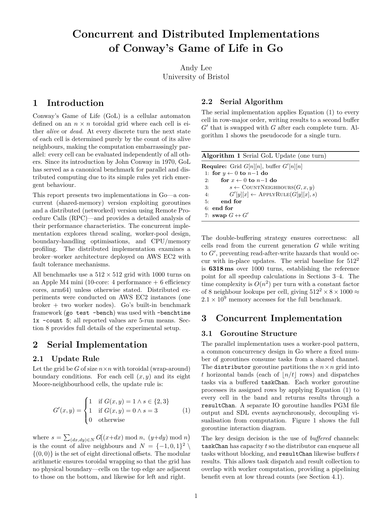
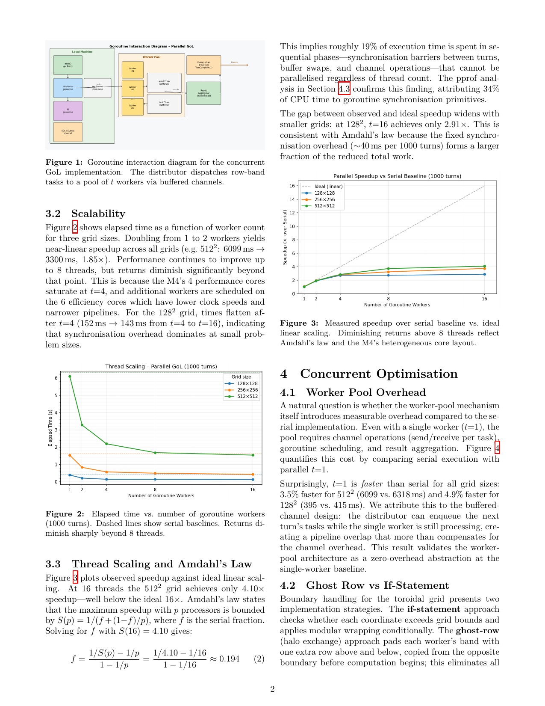
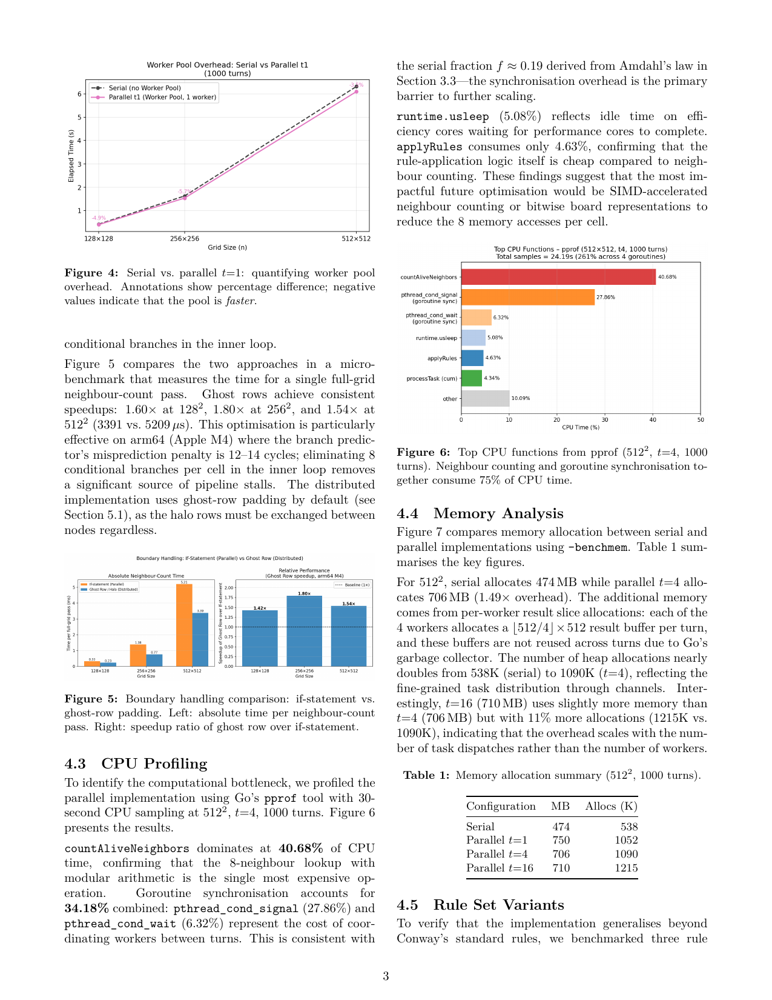
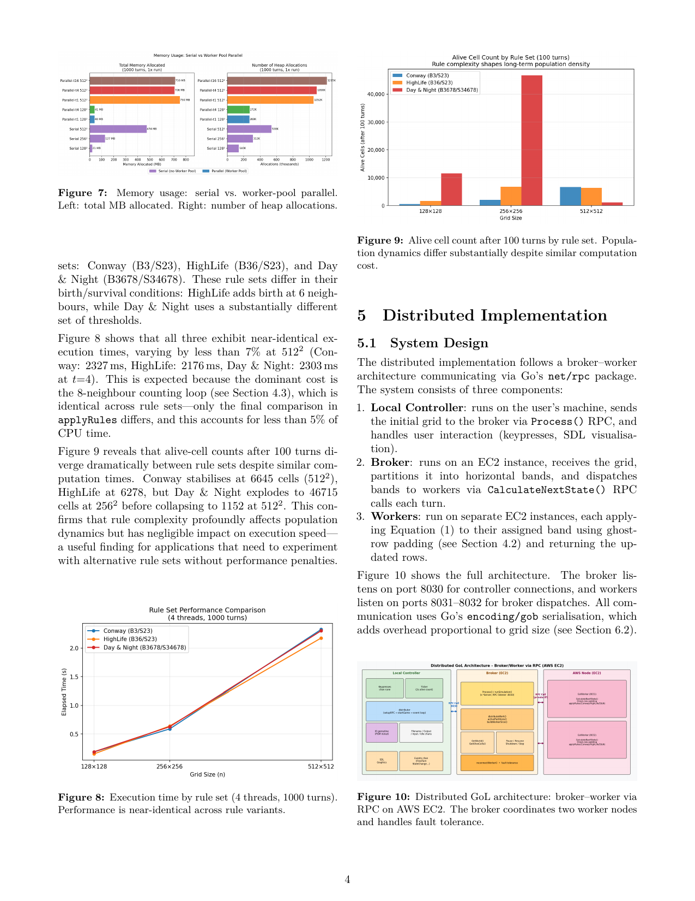
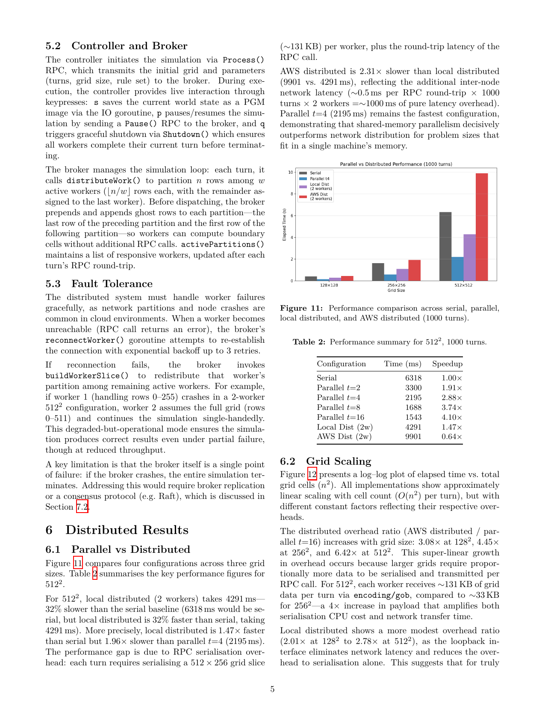
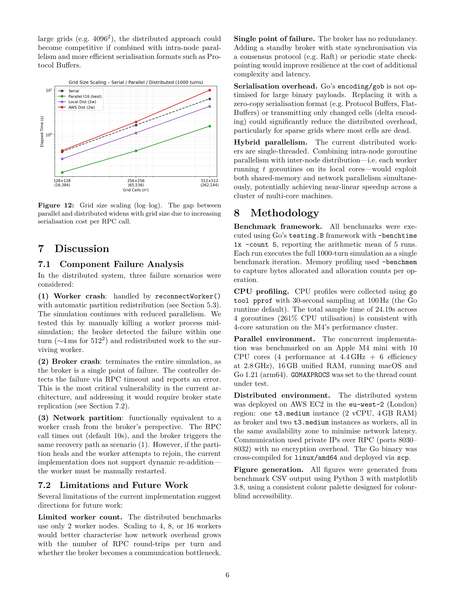

# Concurrent and Distributed Implementations of Conway's Game of Life in Go

Implemented, optimised (worker pool design, communication overhead, architecture considerations) and compared concurrent and distributed versions for Conway's Game of Life.

See all details in the report [here](report.pdf) or in the pages below:

---

## Report Pages

### Page 1

### Page 2

### Page 3

### Page 4

### Page 5

### Page 6

